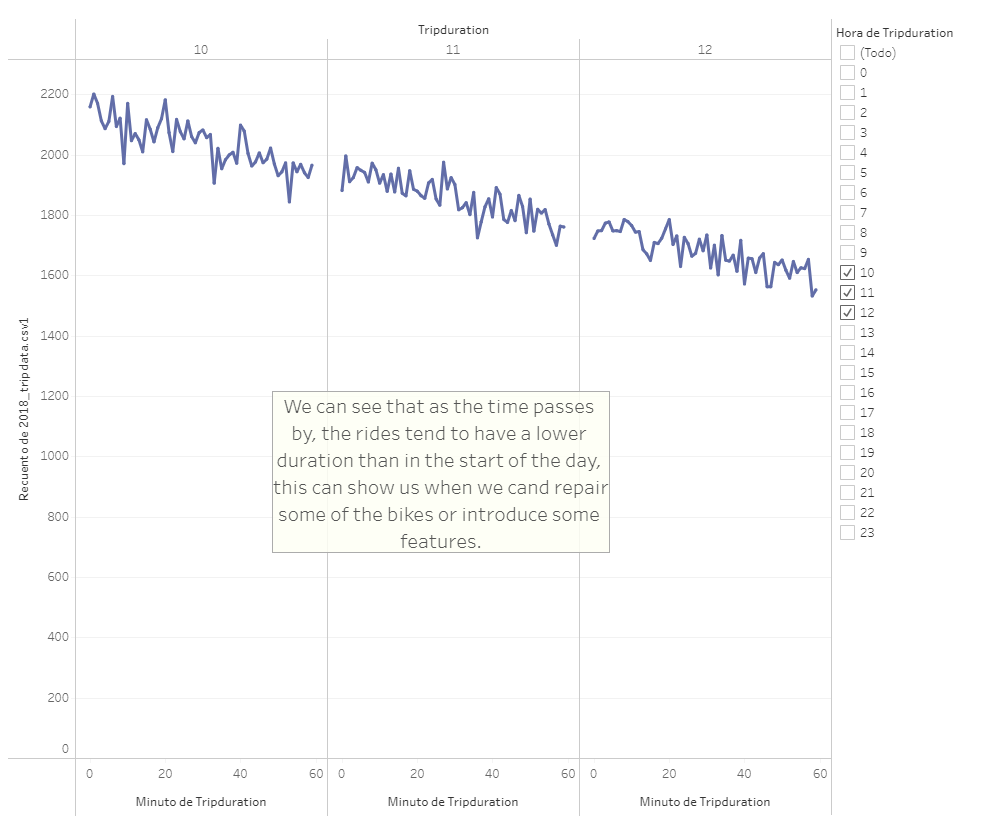
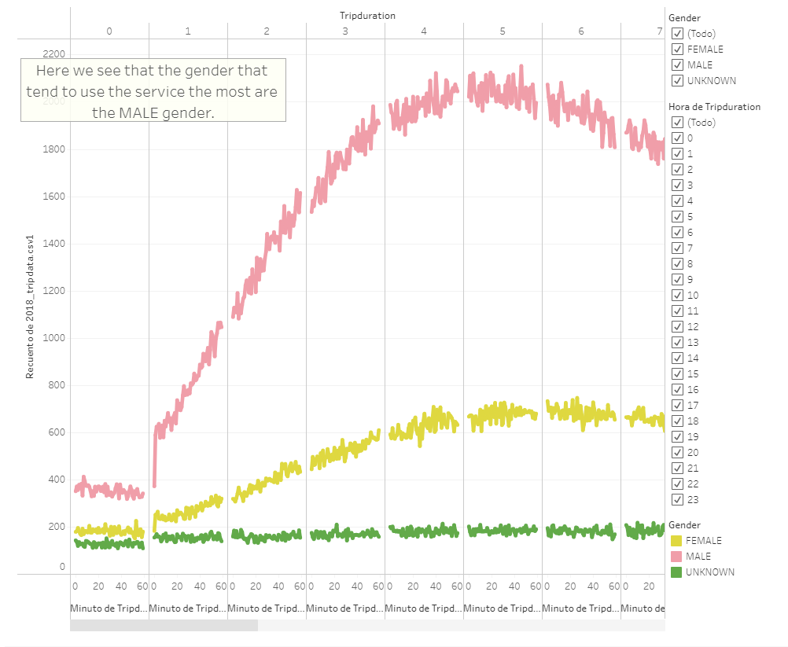
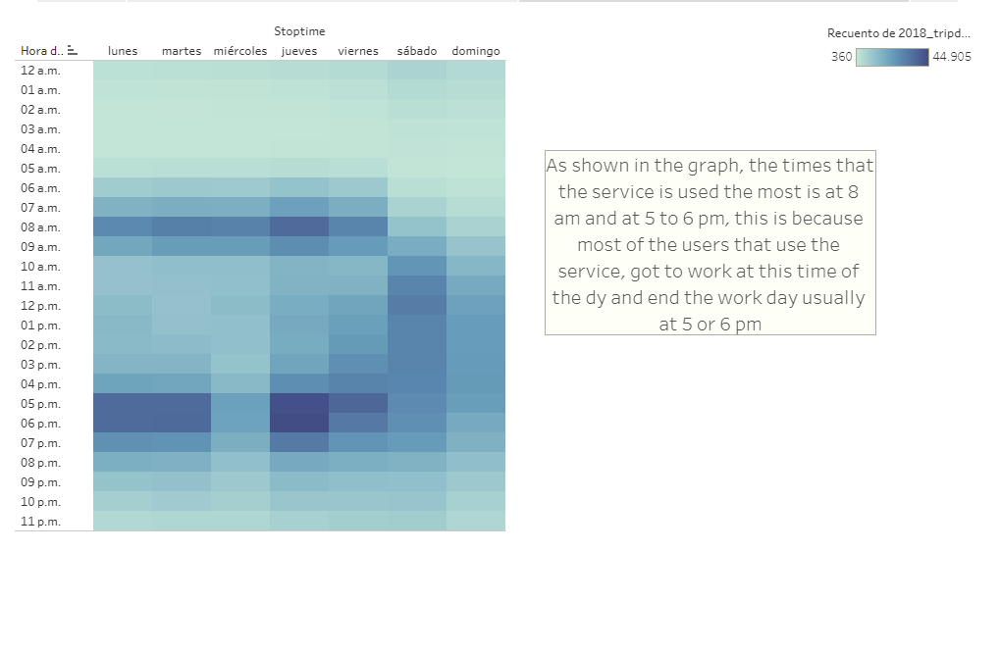
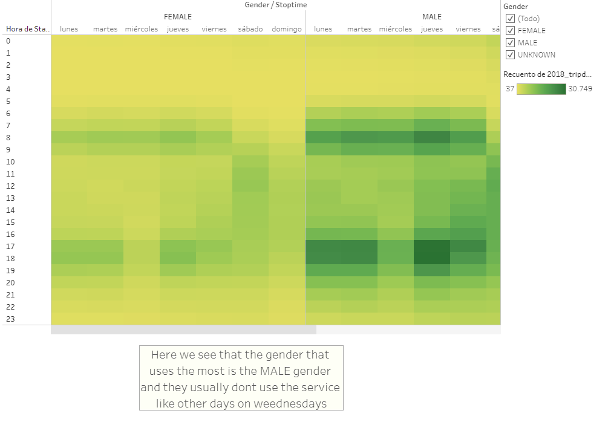
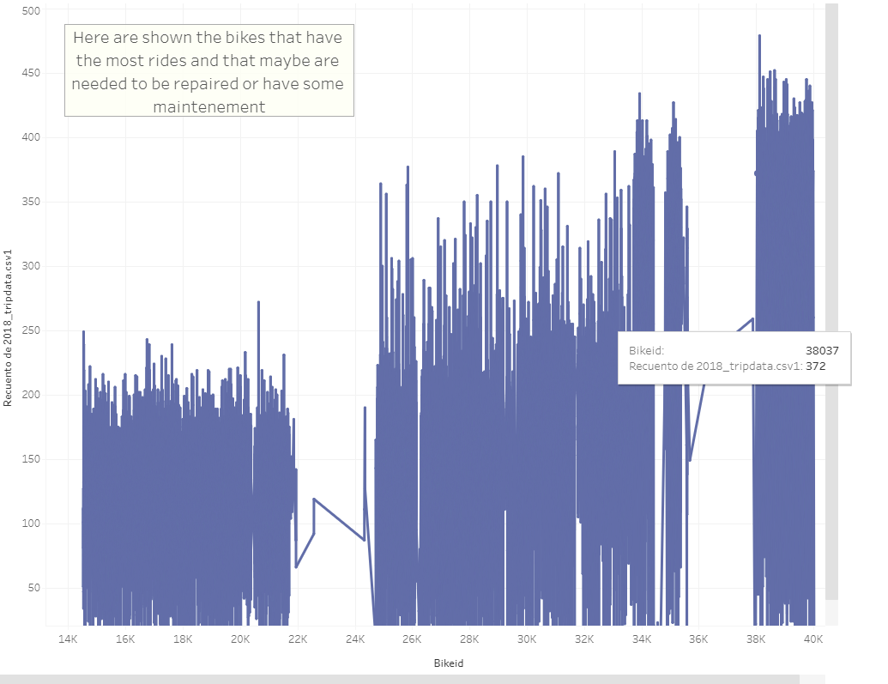
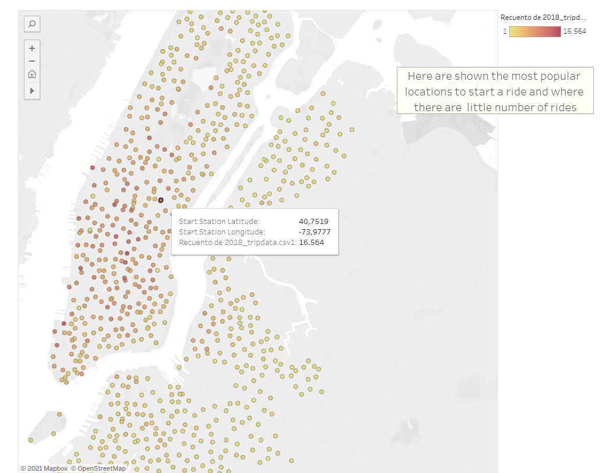

# Bikeride Challenge

## Overview of the analysis

The Bikeride dat in August is used to make some analysis and as it was stated, the data is used to tell different stories and to answer different questions made in order to find something needed, thinking in the good of the bussiness, so we get to make representations of the data depending on what we want.

As we get the diferent graphics and visualizations made, the data is converted into a story that tell us how many people are using the bikes and when, the status of this people, if they arre clients or they have a suscription even if they are male or female, this can  give us an idea of how to approach to the people to maybe increase the users and the income.

## Results

The results can be saw in the next url that let us to the Tableu Public page.

[Tableu Public URL](https://public.tableau.com/app/profile/aldo5272/viz/Challenge_16321614585860/Historia1?publish=yes)

*Every image got a little description about what it's trying to tell*

First, we got the "Checkout times for users"

Second, the "Checkout times by gender"

Third, we got the "Trips by weekday"

Fourth, we got the "Trips by gender (Weekday)"

Fifth, we got the "Users trip by gender"

And finally, we got two visualizations that I considered important to be shown because they are needed to know what bike needs to be fixed or get maintenance, and the other one can give us an idea where is needed to deliver more bikes in order to help more people get a ride.

First visualization "Numbers of rides by bike"

Second visualization "Popular start location"

## Summary

We can see the power of tableu and how it can shows a different type of data visualizations, this is important to show how we can display some of the data that we collect and this way tell a story and answer the important questions when we are facing the data of a enterprise or a little bussiness.